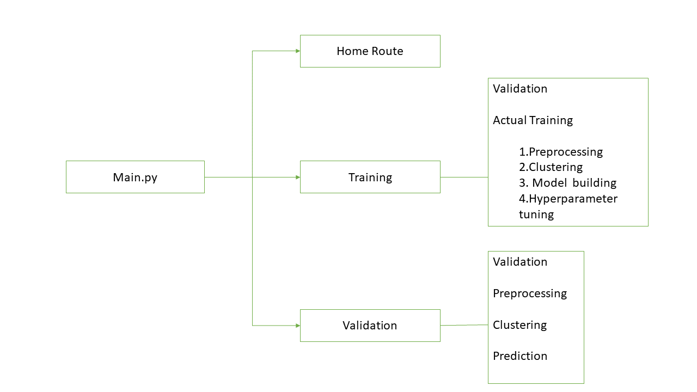

## Badges

Add badges from somewhere like: [shields.io](https://shields.io/)

[](https://www.python.org/downloads/release/python-360/)

[](https://shields.io/)
# Thyroid Detection using Machine Learning
classification methodology to predict the type of Thyroid based on the givem training data
### Description
In this project We are using two algoritms “Random Forest” and "KNN". A clustering approach is being implemented wherein data is clustered and for each cluster, both the algorithms are passed with the best parameters derived from GridSearch. We calculate the AUC scores for both models and select the model with the best score. Similarly, the model is selected for each cluster. All the models for every cluster are saved 
which is used in prediction.

## Architecture

 


Data Ingestion---Involves following steps

                1.Validating Data against predecided format
                2.Data transformation for database insertion
                3.Data insertion into Database

Model Training---Involves following steps

                1.Data preprocessing
                2.Clustering the Data
                3.Getting best model for each cluster
                4.Hyperparameter tunning
                5.Saving model
prediction or test data is subjected to steps in data ingestion and model training

### Data Description
 Data will contain different classes of thyroid and 30 columns of different values.
"Class" column will have four unique values “negative,compensated_hypothyroid,
primary_hypothyroid, secondary_hypothyroid”.

Apart from training files, we also require a "schema" file from the client, which contains all the relevant information about the training files such as:
Name of the files, Length of Date value in FileName, Length of Time value in FileName, Number of Columns, Name of the Columns, and their datatype.

### Data Validation 
In this step, we perform different sets of validation on the given set of training files.  
1.	 Name Validation- We validate the name of the files based onthe given name in the schema file. We have created a regex pattern as per the name given in the schema file to use for validation. After validating the pattern in the name, we check for the length of date in the file name as well as the length of time in the file name. If all the values are as per requirement, we move such files to "Good_Data_Folder" else we move such files to "Bad_Data_Folder."

2.	 Number of Columns - We validate the number of columns present in the files, and if it doesn't match with the value given in the schema file, then the file is moved to "Bad_Data_Folder."


3.	 Name of Columns - The name of the columns is validated and should be the same as given in the schema file. If not, then the file is moved to "Bad_Data_Folder".

4.	The datatype of columns - The datatype of columns is given in the schema file. This is validated when we insert the files into Database. If the datatype is wrong, then the file is moved to "Bad_Data_Folder".


5.	Null values in columns - If any of the columns in a file have all the values as NULL or missing, we discard such a file and move it to "Bad_Data_Folder".

### Data Insertion in Database

1) Database Creation and connection - Create a database with the given name passed. If the database is already created, open the connection to the database. 
2) Table creation in the database - Table with name - "Good_Data", is created in the database for inserting the files in the "Good_Data_Folder" based on given column names and datatype in the schema file. If the table is already present, then the new table is not created and new files are inserted in the already present table as we want training to be done on new as well as old training files.     
3) Insertion of files in the table - All the files in the "Good_Data_Folder" are inserted in the above-created table. If any file has invalid data type in any of the columns, the file is not loaded in the table and is moved to "Bad_Data_Folder".

### Model Training 
1) Data Export from Db - The data in a stored database is exported as a CSV file to be used for model training.
2) Data Preprocessing   
   a) Drop columns not useful for training the model. Such columns were selected while doing the EDA.
   b) Replace the invalid values with numpy “nan” so we can use imputer on such values.
   c) Encode the categorical values
d) Check for null values in the columns. If present, impute the null values using the KNN imputer.
   e)  After imputing, handle the imbalanced dataset by using RandomOverSampler.
3) Clustering - KMeans algorithm is used to create clusters in the preprocessed data. The optimum number of clusters is selected by plotting the elbow plot, and for the dynamic selection of the number of clusters, we are using "KneeLocator" function. The idea behind clustering is to implement different algorithms
To train data in different clusters. The Kmeans model is trained over preprocessed data and the model is saved for further use in prediction.
4) Model Selection - After clusters are created, we find the best model for each cluster. We are using two algorithms, "Random Forest" and "KNN". For each cluster, both the algorithms are passed with the best parameters derived from GridSearch. We calculate the AUC scores for both models and select the model with the best score. Similarly, the model is selected for each cluster. All the models for every cluster are saved for use in prediction.

### Prediction Data Description

Data will contain  names and 30 columns of different values for each class of thyroid. 
Apart from prediction files, we also require a "schema" file from client which contains all the relevant information about the training files such as:
Name of the files, Length of Date value in FileName, Length of Time value in FileName, Number of Columns, Name of the Columns and their datatype.
                

## Flask Application  



# How to run it?

### STEPS:
Clone the Repository

```bash
  https://github.com/shivani21anil/Thyroid-detection.git
```
### STEP 01- Create a conda environment after opening the repository

```bash
  conda create -n Thyroid-detection python=3.6 -y

```
```bash
  conda activate Insurance_fraud_detection

```
### STEP 02- install the requirements
```bash
  pip install -r requirements.txt

```
```bash
  python main.py

```
once application is up and running we have routes for training and prediction.After running training , prediction is made for all the clusters, the predictions along with the names are saved in a CSV file at a given location, and the location is returned to the client.


